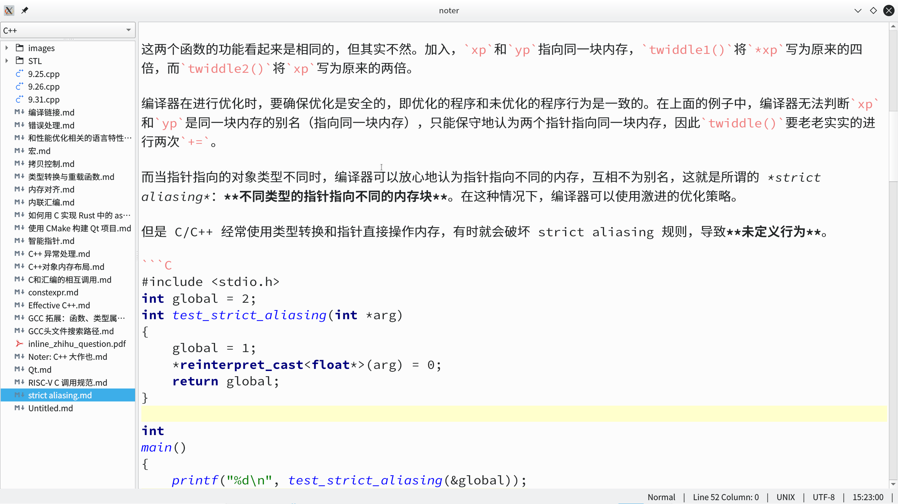

[TOC]

本项目是兰州大学信息科学与技术学院 2019 级 C++ 课程大作业。项目托管于 Github，链接为[Noter](https://github.com/kongjun18/noter)。

队长：孔俊

队员：徐楚佳，王海涛

# 简介

主要实现了以下功能

- 文件树交互
- 笔记本的管理
- 用户配置
- Vim 模式（只实现 normal 模式的部分键位）
- 正则表达式查找
- markdown 高亮（支持 C/C++ 代码块）
- 使用系统默认应用打开文件
- 跨平台（Windows 和 GNU/Linux）
- 实现在主流 C++ 17 编译器及 Qt 代码分析工具 clazy 上 0 warning

截图（Fedora 32 KDE Plasma）如下：



# 依赖

本项目基于 Qt 6，使用 C++ 17 开发。

必要依赖如下：

- Qt 6
- C++ 17 编译器
- CMake 3.16+

可选依赖如下：

- Doxygen： 生成 API 文档
- clazy： 静态分析 Qt C++ 代码
- Firefox 或 Chrome：浏览生成的 API 文档

# 构建


## Windows

这里以 MinGW 工具链为例 。

如果要使用命令行构建，请确保 MinGW 工具链及 CMake 在 PATH 环境变量中，打开 cmd.exe，执行以下命令：

```shell
cmake -DCMAKE_BUILD_TYPE=Debug -DCMAKE_MAKE_PROGRAM=mingw32-make -G "Unix Makefiles" -S. -B_builds
cd _builds
mingw32-make -j8
```

## GNU/Linux

```sh
cmake -DCMAKE_BUILD_TYPE=Debug -S. -B_builds
cd _builds
make -j8
```

GNU/Linux 平台上，Qt 6 一般未安装到标准目录，因此 CMake 很可能无法直接查找到 Qt6,  Qt 6 CMake 文件所在路径赋给变量`CMAKE_PREFIX_PATH`，以我的电脑为例：其他

```sh
cmake -DCMAKE_PREFIX_PATH=/opt/Qt/6.0.0/gcc_64/lib/cmake/ -DCMAKE_BUILD_TYPE=Debug -S. -B_builds
```

## 构建 API 文档

如果系统存在 Firefox/Chrome 和 Doxygen，可以使用以下命令生成 API 文档（html 格式）:

```sh
其他cmake --build _builds --target doc
```

使用以下命令打开 API 文档：

```sh
cmake --build _builds --target open-doc
```

如果使用 Firefox 和 Chrome 外的浏览器，请修改 CMakeLists.txt 中的变量`BROWSER`。


# 项目结构

```
├── CMakeLists.txt 
├── Doxyfile.in 
├── Editor.cpp 
├── Editor.h 
├── Highlighter.cpp 
├── Highlighter.h 
├── LICENSE 
├── log.h 
├── main.cpp 
├── mainwindow.cpp 
├── mainwindow.h 
├── mainwindow.ui 
├── NotebookDialog.cpp 
├── NotebookDialog.h 
├── NotebookListComboBox.cpp 
├── NotebookListComboBox.h 
├── NotebookTreeWidget.cpp 
├── NotebookTreeWidget.h 
├── NoterConfig.cpp 
├── NoterConfig.h 
├── resources
│  ├── resources.qrc 
│  └── zh_CN.qm 
├── SearchPanel.cpp 
├── SearchPanel.h 
├── StatusBarWidgets.cpp 
├── StatusBarWidgets.h 
├── SubstitutePanel.cpp 
├── SubstitutePanel.h
```

各文件功能如下：

- `CMakeLists.txt`: CMake 配置文件
- `Doxyfile.in`: Doxygen 配置文件模板，构建时生成配置文件
- `Editor.{cpp,h}`: 实现编辑器
- `Highlighter.{cpp,h}`: 实现 Makrdown 高亮
- `LICENSE`: 项目软件协议，使用 GPL v3
- `log.h`: 实现简单的日志
- `NotebookDialog.{cpp,h}`: 实现导入、新建笔记本时的弹窗
- `NotebookListComboBox.{cpp,h}`: 实现笔记本列表下拉框
- `NotebookTreeWidget.{cpp,h}`: 实现文件树
- `NoterConfig.{cpp,h}`: 实现 json 配置文件的读写
- `resource`目录: 存放国际化所需的资源文件
- `SearchPanel.{cpp,h}`: 实现正则表达式查找功能
- `SubstitutePanel.{cpp,h}`: 实现替换功能（支持正则表达式），未完全实现
- `StartusBarWidget.{cpp,h}`: 实现状态栏中的一些小部件

代码量统计（使用 cloc）：

```
github.com/AlDanial/cloc v 1.82  T=0.02 s (1221.5 files/s, 157483.8 lines/s)
-------------------------------------------------------------------------------
Language                     files          blank        comment           code
-------------------------------------------------------------------------------
C++                             11            158            290           1984
C/C++ Header                    11             61             45            664
```


# 功能说明


界面左边是文件树，显示当前笔记本中的文件。左上方时笔记本列表，显示当前笔记本，左键单击展开笔记本列表。下方是状态栏，显示当前 Vim 模式，行列号等信息。

为了简洁高效，尽量不设置按钮，文件相关操作通过文件树完成，编辑操作通过 Vim 模式完成。

在 Windows 平台，用户配置文件为 C:\Users\user\AppData\Local\noter\config.json; Linux 平台为 ~/.config/noter/config.json，用户通过修改配置文件调整软件行为。

## 文件树

CRTL+T 打开或关闭文件树，左键单击展开/折叠目录，左键双击修改目录/文件名。右键打开菜单，进行新建、删除、复制路径、使用默认应用程序打开等操作。

创建文件或目录时，在目录上点开菜单则在该目录中创建，在文件上点开菜单就在该文件所在目录创建。创建文件后进入编辑模式，如果用户没有输入文件名，则新建目录名为`UnnamedDir`、`UnnaneDir1`，以此类推;新建文件名为`Untitled`、`Untitled1`，以此类推。

打开软件时文件树显示上次打开的笔记本。

## 笔记本管理

左键单击展开笔记本列表，右键进行删除、导入、新建等操作。目录路径支持 Windows 风格和 UNIX 风格，可以在 Windows 上使用如`~/Desktop`这样的路径，Windows 风格和 UNIX 风格不能混用。


## 配置

配置文件使用 json 格式，如果配置文件不存在，程序创建默认配置。默认配置及选项说明如下：

```json
{
	"centerOnScroll" : false, 		// 滚动到底后光标聚焦于编辑器中间
    "cursorLine": true,				// 高亮当前行
    "fakeVim": true,				// 开启 Vim 模式
    "font": "",						// 字体
    "language": "en_US",			// 语言
    "fontSize" : 14,				// 字体大小
    "lineWrap": true,				// 自动换行
    "wordWrapMode" : "WrapAtWordBoundaryOrAnywhere",	// 单词拆分
    "autoSave": false,				// 自动保存
    "tabStop": 4 					// Tab 键大小（空格数）
}
```

国际化目前只支持简体中文和美式英语，因此`language`只能设置为`en_US`或`zh_CN`，否则弹窗警告并使用默认语言。

`wordWrapMode`设置单词拆分的模式，默认值已经能够很好的适应各种环境，不建议修改，这个选项直接使用`QTextOption::WrapMode`实现，具体可见 Qt 文档。

## 查找

CTRL+F 打开查找面板，从光标位置开始查找并高亮匹配到的模式。正则表达式使用 Qt 风格（基于 Perl 风格），支持三种查找模式，Case Insensitive 表示不区分大小写， Case Sensitive 表示区分大小写， Whole Word 表示查找整个单词。


## Vim 模式

不支持 Vim 键位的编辑器不是好编辑器，但仍有大量流行的文本编辑器不支持 Vim 模式，如本项目参考的 Windows 记事本和 Typora（一个所见即所得的 Markdown 编辑器），因此萌生了添加 Vim 模式的想法。

目前只实现 normal 模式的部分键位：`a e i w b h l j k x u r 0 o W E B D C S O A I $`，所以 Vim 模式暂时只能胜任光标附近的编辑操作。

状态栏提示光标行列号和所在的模式。


## 高亮

支持高亮 Github-style Markdown 的绝大多数语法元素。

代码块暂时仅支持 C/C++，支持 C++ 20 的全部关键字。

-----------------------


# 开发体验与思考

在开始项目开发时，Qt 正式发布了 Qt 6.0.0 版本，该版本适配了 CMake 和 C++17，Qt 6 是 Qt 的未来，因此使用了该版本进行开发。

## 文档

Qt 文档非常完善，我在开发过程中的几乎所有问题都在 Qt 文档和官方教程中找到了解答。但是，文档的表现力仍然非常有限，很难让程序员完全了解代码的行为，比如 Qt 关于坐标系统和字体的文档就相对晦涩，通过大量实验代码才能有所了解，Qt 为了解决这个问题创建了不少教程并给出了代码，但也只能够缓解这个问题。

我在编写注释时也遇到了类似的问题，相对复杂的函数很难完整叙述它的行为，而非常简单的函数加上注释会在源代码中产生“噪声”，但不加注释就会导致使用 Doxygen 等工具生成的 API 文档中出现“空白”。

由于 Qt 引入了信号槽机制，对象与对象之间存在比较复杂的连接关系，而文档系统一般只是介绍单个类，对类实例之间关系的描述无能为力。

文档还可能存在文档和代码不一致的问题，比如代码修改了却没有修改文档，或者是写了代码没有写文档。本项目就存在有代码无文档的情况，比如开发类`NoterConfig`（负责配置的读写）时心情比较舒畅，注释就非常完善;而`NotebookTreeWidget`是本软件最重要、最复杂的类，实现时刚刚了解 Qt 的 Model/View 模型，实现得比较困难，注释就比较少，这一点需要改进。

## API 设计

Qt 以 API 设计优秀而闻名，讨论 Qt 的 API 设计原则的文章也有不少，如 Qt Wiki 上的[API-Design-Principles](https://wiki.qt.io/API-Design-Principles)，这里不再赘述。

即使是 Qt 这样精心设计过的 API 也仍然存在语义模糊和反直觉的地方。本项目开发过程中就因为 Qt API 设计的语义模糊之处花费了大量时间精力。Qt 跨平台，但在文件路径的表示上一律使用 UNIX 风格，所有目录 API 返回的路径名都以`/`分隔，文档中没有提到这一点，还提供了一个将路径分隔符转换为系统原生分隔符的静态函数`QDir::toNativeSperator()`，这让人误以为 Qt 文件路径使用的是系统原生的路径。

Qt 文件/目录 API 的设计导致用户很容易写出错误的代码，如 Windows 上“文档”文件夹的路径为`C:\User\user\Documents`，使用目录 API 获取该路径：

```C++
QDir::homePath().append(QDir::toNativeSepecator(QStringLiteral("/Documents")))
```

但由于`QDir::homePath()`返回的路径是 UNIX 风格的，以上代码片段的返回值是`C:/User/user\Documents`，混用了 UNIX 和 Windows 风格，导致很多意料不到的错误，有些操作正常完成，有些操作失败。

## 异常

由于历史原因，Qt 没有使用异常，这导致了很多不良的后果。我在开发过程中遇到的打开有以下几类

- 重复的错误检测

  `NoterConfig`类多次解析 json 配置文件，每次解析都可能遇到错误，由于不使用异常，必须在每次解析后都判断是否有遭遇错误，即使将错误检测封装函数，也需要多次条件结构和函数调用，很枯燥。

- 无法判断错误类型

  某些 API，如文件系统相关的 API 返回值时 bool 类型，并且没有提供类似于`lastError()`的接口，只能判断是否成功，而不知道错误原因。

- 忽略非致命的错误导致程序错误运行

  大量的 API 可以在使用方法不当的情况下错误运行，有些 API 会在错误使用时通过`qWarning()`打印警告信息，但是警告信息往往会被淹没在日志文件中，没法及时发现错误，导致程序行为异常。

## 面向对象编程

开发过程中感觉到了在面向对象分析、设计、编程上存在巨大的不足。

我在开发的过程中依照”低耦合，高内聚“的原则，尽量让所有的类互相不感知，通过信号槽机制进行沟通交互。但在面对具体的设计问题时，不能清晰地判断那种方案更优，更多的时凭借直觉和从保持设计一致性出发进行抉择。

比如，开发中经常出现三种方案：

1. 一个对象作为另一个对象的成员
2. 一个对象拥有另一个对象的指针
3. 对象之间使用信号槽沟通

我认为方案一很不灵活，让对象有了很大的局限，并且不能充分利用 Qt 特性，比如 Qt 无法自动在窗口缩放时计算大小，需要自己重写`sizeHint()`。

方案二似乎不符合低耦合，但编程确实比较方便。

方案三有性能损失，并且需要写多个槽函数，编程没有二方便（使用 lambda 缓解了这个问题），但方案三中对象之间互相不感知，似乎比较耦合比较低，并且信号槽机制时 Qt 官方推荐的，我因此选择了方案三。

对面向对象更多主要是感性认识，还需要将来更深入的学习研究。

## Qt 方言化 C++ 导致的问题

Qt 创造了 C++ 方言，使用元编译器（moc）将 Qt C++ 转换为 ISO C++。然而，编译器只能检测出最后生成的 ISO C++ 的错误，对 Qt C++ 的错误和误用无能为力，比如`emit`了一个不是信号的函数，这在 Qt 里是错误的，然而最后生成的标准 C++ 代码却可以正确编译，并且运行没有问题（在我的电脑上)。

Qt 提供了一系列方法克服这个问题，比如 Qt 5 引入的新的信号槽连接函数，在`QObject::connect()`中使用函数指针表示信号和槽，替换 Qt 4 使用`SIGNAL()`和`SLOT()`宏表示信号/槽，实现了编译器的类型检测，避免运行期错误，但是在出错时，比如将使用了不属于某个类的的槽函数，报错信息是最后生成的标准 C++ 代码，无法直接知道源代码的错误原因。

Qt 提供了静态分析工具 clazy 来检测 Qt C++ 的错误，但大量 Qt 用户甚至都不愿意看编译器的 warning，更不会去使用 clazy 检测代码，导致错误的 Qt C++ 代码运行起来。

clazy 由 KDE 开发，基于 clang-tidy 定制，据 KDE 官方所说，clazy 可以检测出 99.99% 的 Qt 错误使用。这个工具相当强大，可以检测出相当多的错误，比如上面提到的`emit`不是信号的函数，并且警告信息可读性强，比如：

```
Editor.cpp|3 col 16| warning: Missing reference on large type (sizeof std::unordered_map<QString, QVariant> is 56 bytes) [-Wclazy-function-args-by-ref]
 Editor::Editor(std::unordered_map<QString, QVariant> editorConfig,
                ^
                const                                 &
Editor.cpp|68 col 40| warning: Pass small and trivially-copyable type by value (const class QPoint &) [-Wclazy-function-args-by-value]
 Editor::customContextMenuRequestedSlot(const QPoint& pos)
                                        ^~~~~~~~~~~~~~~~~
|                                       QPoint pos

```

本项目经 clazy 分析后发现了几十个错误的 Qt 用法，大概报了 500 行 warning，已经全部修复，实现了 0 warnning。

Qt 早于 modern C++，已经创造了不同于 modern C++ 的编程风格，导致了虽然 Qt 6 适配了 C++17，但编程的过程中总有些“违和感”，比如 modern C++ 使用智能指针、引用，避免裸指针，但 Qt 一律使用裸指针;modern C++ 使用 RAII 管理资源，而 Qt 使用对象树机制管理资源;modern C++ 传参往往使用引用，而 Qt 常用类使用隐式共享（写时复制），推荐直接传值，上面的警告就和这个有关。

## Qt 跨平台的体验

Qt 虽然是跨平台的框架，但无法做到面向 Qt 编程，忽略底层系统的区别，仍然要针对底层系统进行处理，比如上述文件路径的处理。

除此之外，Qt 在不同平台上的行为有差异，并且有些差异没有文档化，给程序员定位、解决问题带来麻烦。这些差异要求程序员用不同的方式使用 API，否则就只能在某一特定平台工作，本项目开发过程中多次遭遇这类问题。

比如，菜单栏在 Linux 平台上一切正常，但在特定版本的 Windows10 上不响应鼠标点击;`QComboBox`在 Windows 上下拉，在 Linux 上根据当前项选择上拉或下拉;Windows 上状态栏自动加分隔符，而 Linux 上不加分隔符;在 Windows 上一切正常，在 Linux 上却打印出警告信息。


-------------------


# TODO

- [ ] 支持更多的 Vim 模式
- [ ] 完成替换功能
- [ ] Markdown 预览
- [ ] 改进交互体验
  - [ ] 导入/新建笔记本时进行路径补全
- [ ] 高亮 Markdown 代码块中的跨行注释

# bug 

- [ ] 无法使用系统默认应用程序打开含有中文路径的文件